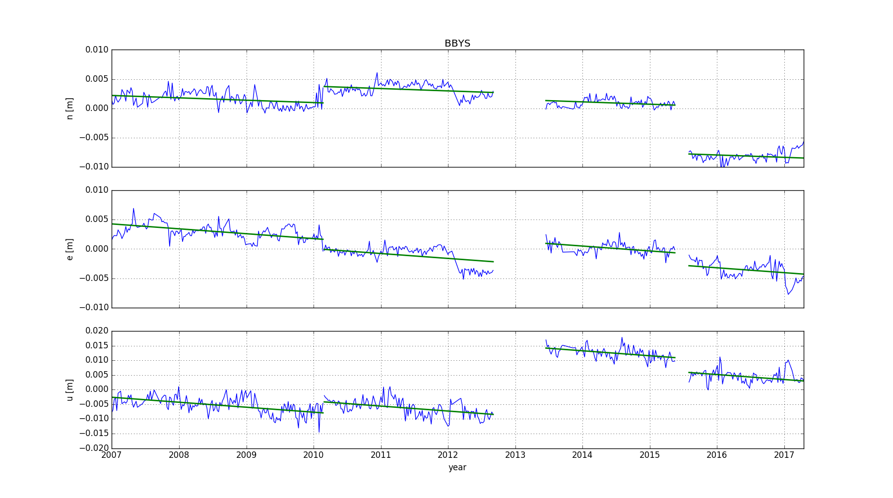
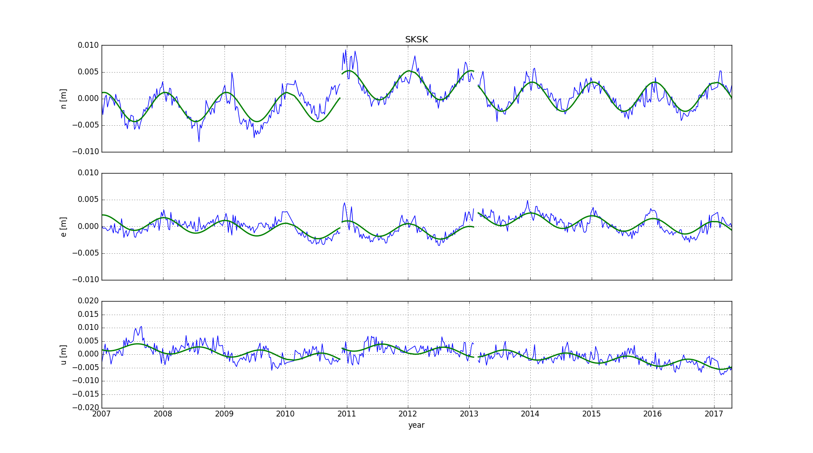
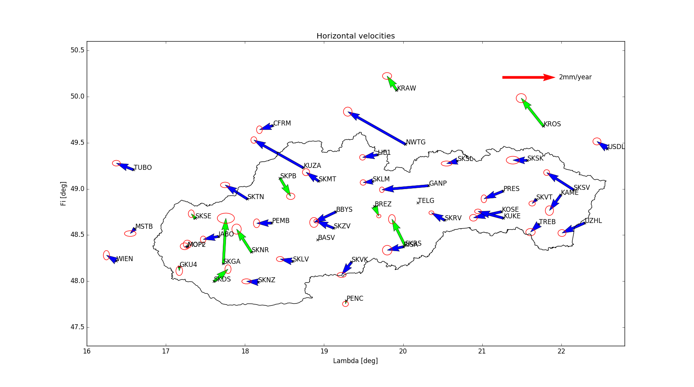

# TSPRO
Simple GUI for estimation of horizontal and vertical velocities of GNSS stations
from their time series.

## How does it work?
* load disco file - your file with dates of discontinuities i.e. inputs/20170614.dst
* load exclusion file - time intervals for exclusion i.e. inputs/custom.excl
* select Data directory - directory with all stations' coordinates i.e. inputs/time_series_20170614/
* choose estimation options
* compute one/all stations

## Examples

### Linear trend estimation including jumps
Dates of jumps have to be known or derived from Bernese5.2 file (FODITS output) using Options --> FOD2DISCO 
in TSPRO program.


### Trend estimation including yearly period


### Horizontal velocities based on permanent GNSS stations


### Run GUI
```
> python TSPRO.py
```